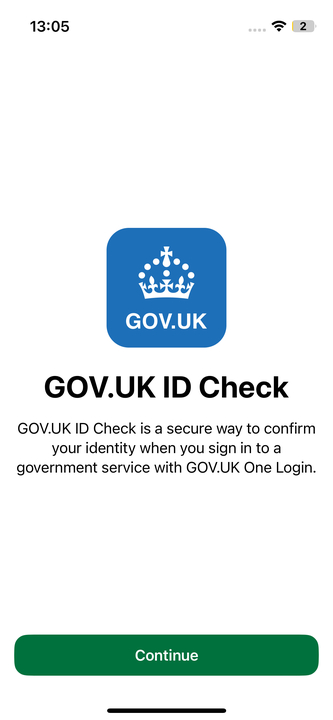
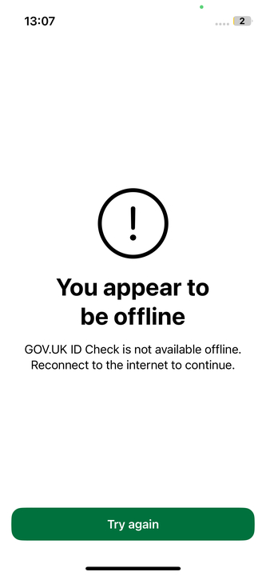
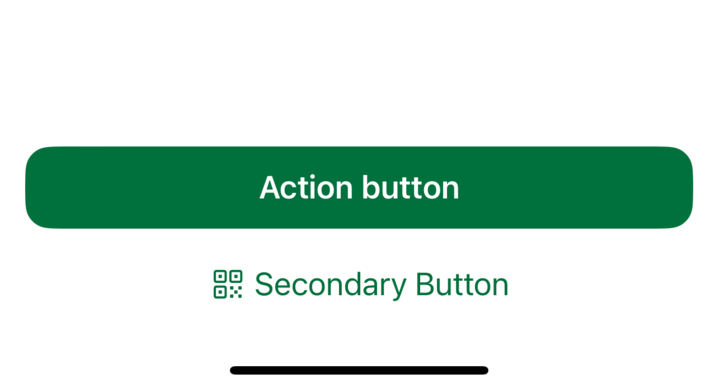
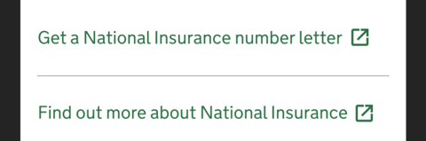
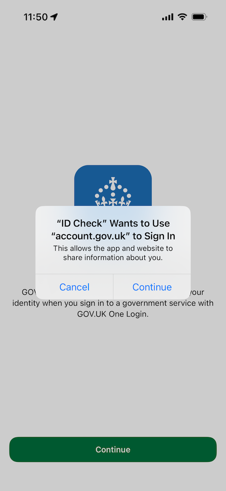
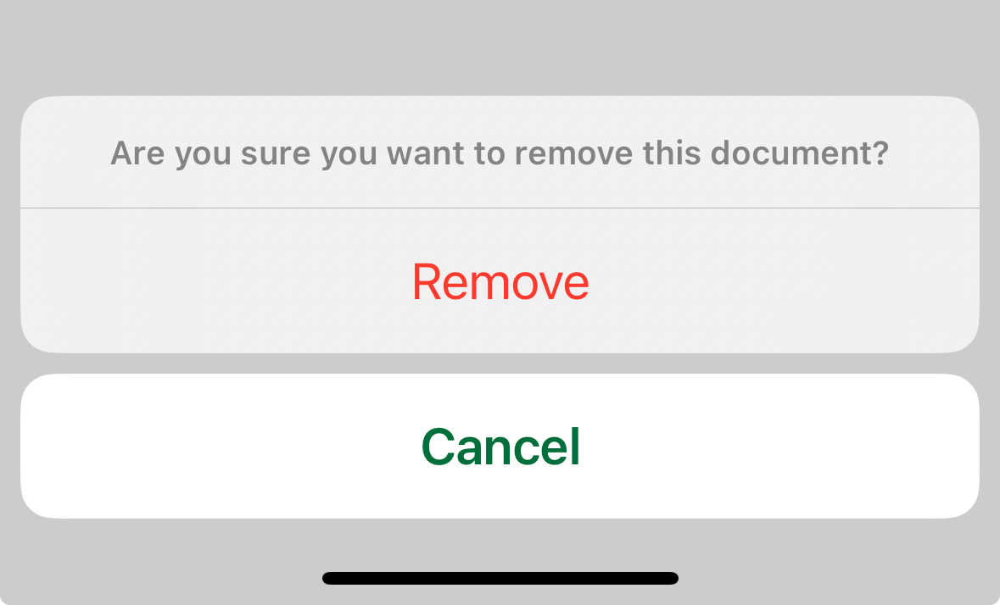
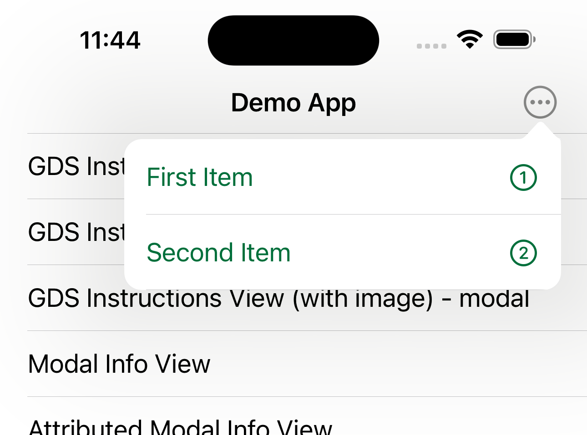
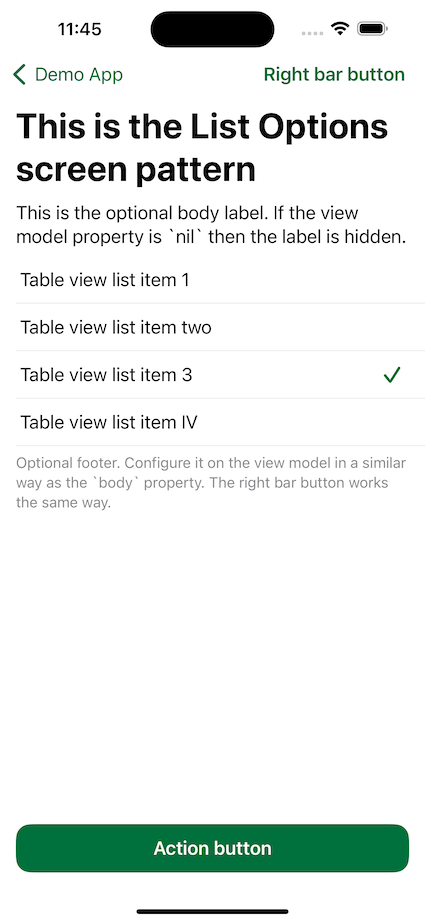

# GDS Analytics

A set of models that mirror the GDS Digital Identity Analytics Implementation Guide for Google Analytics. 

All data gathered via the Firebase SDK stream into the wider GDS Google Analytics account, therefore it is vital that all tracking aligns with the wider organisations approach and guidance.
These models ensure that all analytics submitted from the app are formed-correctly.

This package does not submit events, it is only for structuring the output accordingly.
We recommend using the Analytics package alongside our [Logging package](https://github.com/govuk-one-login/mobile-ios-logging) to submit the events to Firebase Analytics.

## Screen Tracking

### Standard Screens

Use the `ScreenView` type to represent screens that a user navigates through in the app.

This type is generic and can be used to represent any type which has a name.
We generally use enums to give type-safety to our screen tagging:

```swift
enum MyAppScreens: String {
    case home = "HOME"
    case settings = "SETTINGS"
}

extension MyAppScreen: NamedScreen {
    var name: String {
        rawValue
    }
}
```

In this case, we would be able to generate the correct parameters for our screen:

```swift
let screenView = ScreenView(screen: MyAppScreens.home, 
                            titleKey: "Welcome to GOV.UK One Login")
```

> Here the `titleKey` is an `NSLocalizedString` key. Passing in the key ensures that parameter values are always returned in English regardless of the device setting. If the string contains variable arguments (e.g. %@, %d), these can also be included with the `variableKeys` initialiser parameter: 
>
> ```swift
> ScreenView(screen: MyAppScreens.home, 
>            titleKey: "Welcome to %@", 
>            variableKeys: ["GOV.UK One Login"])
> ```
>
>You can pass in a localised string directly into this parameter to ensure that localised parameter values are used.

Example: 



#### Expected Parameters:

| Parameter | Description | Expected Format | Example |
| ------------- |-------------| ----- | ---- |
| screenName | Unique name for each app screen, irrespective of screenClass used to identify pathways in the user journey. | SNAKE_CASE. Maximum of 40 characters. | `FRONT_INSTRUCTION` |
| title | The frontend display title | lowercase | Lowercase and no longer than 100 characters | `how to take a photo of your photo id` |

### Error Screens

Use the `ErrorScreenView` to represent error screens.

This is an extension of the `ScreenViewProtocol`, meaning it contains the same functionality as `ScreenView`, but allows you to pass in additional information about the error that has occured.
This helps the analytics team to distinguish between the multiple types of error that may occur throughout the app.

Either include each of the error parameters separately:

```swift
let screenView = ErrorScreenView(
    screen: ErrorScreen.generic,
    titleKey: "Something went wrong",
    endpoint: "appInfo",
    statusCode: "401",
    hash: "83766358f64858b51afb745bbdde91bb"
)
```

Or pass in an error that conforms to the `LoggableError` protocol:

```swift
extension URLError: LoggableError {
    public var endpoint: String? {
        failingURL?.pathComponents.last
    }
    
    public var statucCode: String? {
        errorCode.description
    }
}

let screenView = ErrorScreenView(
    screen: ErrorScreen.generic,
    titleKey: "Something went wrong",
    error: urlError
)
```

#### Expected Parameters:

`screenName` and `title` as per standard screens, above.

| Parameter | Description | Expected Format | Example |
| ------------- |-------------| ----- | --- |
| endpoint | The API or SDK endpoint being called by the application which caused the error. | Optional. Lowercase. | `appinfo` |
| reason | The reason the error was thrown: i.e. if the user has no internet connection, or an error was thrown by the API. | Optional. Lowercase. | `network` |
| status | The HTTP status code that was thrown by the remote service. | Optional. Lowercase. | `401` |
| hash | A unique error code / hash for the error. Usually an MD5 hash of the endpoint and status code. | Optional. Lowercase. | `83766358f64858b51afb745bbdde91bb` |

Example:




## Event Tracking

There are different types of events that can be tracked:
* Button Press, i.e. continue or submit form or back
* Link Press, i.e. prove your identity another way or view privacy policy
* Form Submission, i.e. user selects an option in a checkbox or text field
* Popup Alert, 

### Button Press

A button press is an event where the user taps a button but remains in the app, i.e. navigation to another screen.
Use the `ButtonEvent` type for this.

```swift
let event = ButtonEvent(textKey: "Confirm your identity another way")
```

#### Expected Parameters:

| Parameter | Description | Expected Format | Example |
| ------------- |-------------| -----| --- |
| name | The name of the event that occured, for button events this is `navigation`. | N/A | `navigation` |
| type | The type of event that occured, for button events this is `submit form`. | N/A | `submit form` |
| text | The text displayed on the button that was pressed. | Lowercase. Limited to 100 characters. | `confirm your identity another way` |

Example: 



### Link Press

Use the `LinkEvent` type for this

```swift
let event = LinkEvent(textKey: "Confirm your identity another way",
                      linkDomain: "https://www.gov.uk",
                      external: .true)
```

#### Expected Parameters:

| Parameter | Description | Expected Format | Example |
| ------------- |-------------| -----| --- |
| name | The name of the event that occured, for links this is `navigation`. | N/A | `navigation` |
| type | The type of event that occured, for links this is `generic link. | N/A | `generic link` |
| text | The text displayed on the button that was pressed. | Lowercase. Limited to 100 characters. | `confirm your identity another way` |
| link domain | The web domain of the link that was pressed. | Lowercase. Limited to 100 characters. | `https://signin.build.account.gov.uk` |
| external | Indicates whether the link is to an external domain. | Lowercase. | `true` or `false` |

Example: 



### Popup Alerts

This type of event should be logged when a call-to-action is displayed, usually this would be a `UIAlertController` but it may also be used for other modal inputs. Use the `PopupEvent` type for this.

```swift
let event = PopupEvent(textKey: "Change your permissions")
```

#### Expected Parameters:

| Parameter | Description | Expected Format | Example |
| ------------- |-------------| -----| --- |
| name | The name of the event that occured, for popups this is `popup`. | N/A | `popup` |
| type | The type of event that occured, for popups this is `call to action`. | N/A | `call to action` |
| text | The text that is displayed on the popup. | Lowercase. Limited to 100 characters. | `change your permissions` |

Example:



### Action Menu 

This type of event fires when a custom systemAlert popup appears on the screen, usually this would be a `UIAlertController` of the type `.actionSheet`. Use the `ActionMenuEvent` type for this.

```swift
let event = ActionMenuEvent(textKey: "Change your permissions")
```

#### Expected Parameters:

| Parameter | Description | Expected Format | Example |
| ------------- |-------------| -----| --- |
| name | The name of the event that occured, for popups this is `popup`. | N/A | `popup` |
| type | The type of event that occured, for alerts this is `actionMenu`. | N/A | `actionMenu` |
| text | The text that is displayed on the popup. | Lowercase. Limited to 100 characters. | `change your permissions` |

Example: 



### Icon Event 

This type of event fires when a user interacts with a button (with an icon rather than a title) to navigate from one screen to another.

```swift
let event = IconEvent(textKey: "close")
```

#### Expected Parameters:

| Parameter | Description | Expected Format | Example |
| ------------- |-------------| -----| --- |
| name | The name of the event that occured, for popups this is `navigation`. | N/A | `navigation` |
| type | The type of event that occured, for alerts this is `icon`. | N/A | `icon` |
| text | The text that is displayed on the popup. | Lowercase. Limited to 100 characters. | `close` |

Example: 



## Form Events

### Form Submission

If the user enters a value, such as selecting an option in a checkbox or typing into text field, the form submission event should be sent when the user taps the submit button. Use the `FormEvent` type for this.

```swift
let event = FormEvent(textKey: "Did you start on a computer or tablet?",
                      responseKey: "Yes, I started on a computer or tablet")
```

#### Expected Parameters:

| Parameter | Description | Expected Format | Example |
| ------------- |-------------| -----| --- |
| name | The name of the event that occured, for forms this is `form_response`. | N/A | `form_response` |
| type | The type of event that occured, for forms this is `simple smart answer`. | N/A | `simple smart answer` |
| text | The text of the question that was asked in the form. | Lowercase. Limited to 100 characters. | `did you start on a computer or tablet?` |
| response | The response to the form that the user entered. | Lowercase. Limited to 100 characters. | `yes, I started on a computer or tablet` |

Example:



### Form Action Menu Event 

This type of event fires once a user responds to a CTA that is dismissible.
```swift
let event = FormActionMenuEvent(textKey: "question answer")
```

#### Expected Parameters:

| Parameter | Description | Expected Format | Example |
| ------------- |-------------| -----| --- |
| name | The name of the event that occured, for popups this is `formResponse`. | N/A | `formResponse` |
| type | The type of event that occured, for alerts this is `actionMenu`. | N/A | `actionMenu` |
| text | The text that is displayed on the popup. | Lowercase. Limited to 100 characters. | `question answer` |

Example: 


### Form CTA Event 

This type of event fires once a user responds to a non dismissible CTA i.e. the camera permissions CTA
```swift
let event = FormCTAEvent(textKey: "action menu key")
```

#### Expected Parameters:

| Parameter | Description | Expected Format | Example |
| ------------- |-------------| -----| --- |
| name | The name of the event that occured, for popups this is `formResponse`. | N/A | `formResponse` |
| type | The type of event that occured, for alerts this is `callToAction`. | N/A | `callToAction` |
| text | The text that is displayed on the popup. | Lowercase. Limited to 100 characters. | `action menu key` |

Example:


